# diele


**Do more with your new tab page: search, launch and admin for everything you run.**

Open a tab and the cursor is already in the search bar. Type, and diele searches your service
cards, your saved sites, your repos and your local dev servers together - by name, by url and by
keyword - then `↵` opens the best match. Nothing matches? The same `↵` searches the web.

Everything it shows is a row in its own database, edited from a panel inside the page. There are
no config files to redeploy: add a card, change the wordmark, plug in a GitLab token, and the
next tab has it.

- **One bar over everything you own** - cards, saved sites, repos and local ports, ranked above the web
- **A keyboard the whole way down** - nothing is reachable only by mouse
- **Connectors** - GitLab and GitHub repos sync in on a timer, each with their own quick jumps
- **Liveness** - a dot per card, from an HTTP probe, Uptime Kuma or a Prometheus query
- **Alerts** - what Prometheus is firing right now, on one line above the search field
- **An admin panel, not a config file** - every row edited in the page, the whole configuration exportable as one document
- **Three ways to sign in** - OpenID Connect, local accounts, or a dev mode while you build
- **One container** - one port, one volume, and a database that is a file

> **Status:** used daily, but young. The endpoints and the database schema are still moving, and
> there are no releases yet. See [Planned](#planned) for what is not here.

## Table of contents

- [diele](#diele)
  - [Table of contents](#table-of-contents)
  - [Features](#features)
    - [Search](#search)
    - [Keyboard control](#keyboard-control)
    - [Slash commands](#slash-commands)
    - [Search engines](#search-engines)
    - [Cards](#cards)
    - [Saved sites](#saved-sites)
    - [Local ports](#local-ports)
    - [Subreddit jump](#subreddit-jump)
    - [Light and dark](#light-and-dark)
    - [The admin panel](#the-admin-panel)
    - [Export and import](#export-and-import)
    - [Signing in](#signing-in)
    - [Connectors](#connectors)
      - [GitLab](#gitlab)
      - [GitHub](#github)
      - [Uptime Kuma](#uptime-kuma)
      - [Prometheus](#prometheus)
    - [Liveness](#liveness)
    - [Alerts](#alerts)
    - [Planned](#planned)
  - [Installation](#installation)
    - [Docker](#docker)
    - [Making it your new tab page](#making-it-your-new-tab-page)
    - [Backing up](#backing-up)
    - [Which tag](#which-tag)
    - [From source](#from-source)
  - [Documentation](#documentation)
  - [License](#license)

## Features

### Search

The bar takes focus on load, so a new tab can be typed into straight away. It searches the service
cards, the saved sites, the connector rows and the local ports together, by name, by url and by
keyword.

Matching is fuzzy, so `prometeus` still finds Prometheus and `uk` finds Uptime Kuma. Paths split on
their separators, so `example-group/web` matches both halves. A term that is really a url -
`example.com`, `localhost:3000`, a pasted link - leads the results as **Go to**.

What diele already knows ranks above the web: the first match is highlighted, so `↵` opens it. To
search the web anyway, `↑` steps off the list and hands `↵` back to the engine.

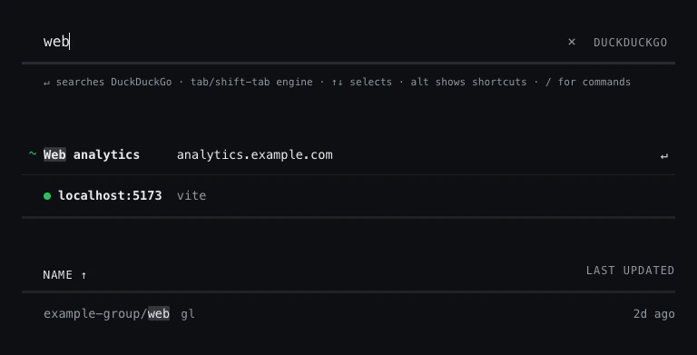

### Keyboard control

Nothing is reachable only by mouse, and the admin and settings views reuse the same ring.

| key | does |
| --- | --- |
| `↵` | opens the highlighted entry, or searches the web when nothing is highlighted |
| `cmd`/`ctrl`+`↵` | the same, but alongside in a second tab |
| `↑` `↓` | move the highlight; stepping off either end returns to the field |
| `←` `→` | step through a repo's own page, its pipelines, merge requests and releases |
| `tab` / `shift`+`tab` | cycle the search engine forwards or back |
| `alt`+`1`-`9`,`0` | open that card; holding `alt` reveals the badges |
| `/` | as the first character, opens the commands; from elsewhere, focuses the field |
| `esc` | backs out one level at a time |

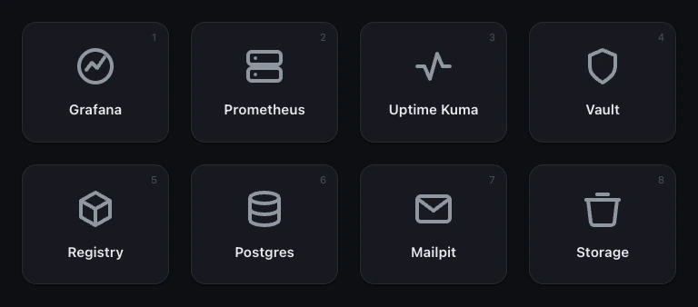

### Slash commands

A term starting with `/` addresses the commands and nothing else, so a slash never fuzzy-matches
its way into an ordinary result. `/` on its own lists them.

`/admin`, `/settings` and `/logout` are built in and cannot be redefined. The rest are a keyword
plus a query url carrying `{query}`, added in the admin panel, so `/yt cats` goes straight to
YouTube without the term ever touching the default engine.

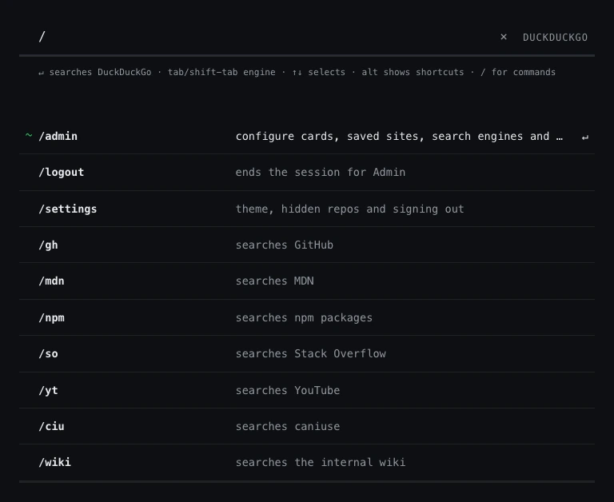

### Search engines

What `↵` submits to when nothing local matched. The first one is the default and every visit starts
there; `tab` cycles through the rest without leaving the keyboard.

An engine is a name and a url carrying `{query}`, so anything with a search url can be one.

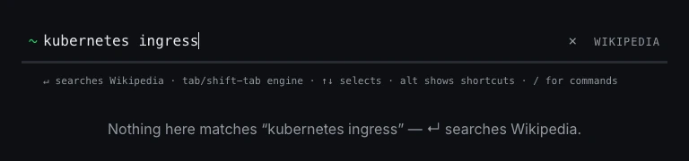

### Cards

The logo grid on the resting page: the services you open often, each a label, a url, keywords and
an icon.

Icons are uploaded rather than bundled. An svg is sanitised on the way in and its paint rewritten
to `currentColor`, so an uploaded logo sits monochrome at rest and takes its brand colour on hover
like the built-in ones.

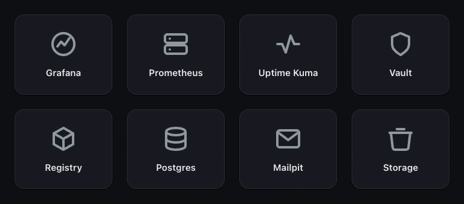

### Saved sites

Everything that does not deserve a logo on the front page but should still be one keystroke away.
They are suggested as results when the term matches them, and stay out of the way until it does.

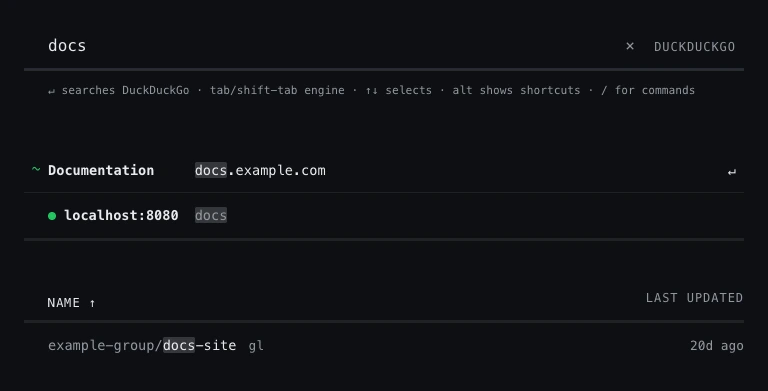

### Local ports

Dev servers on the machine holding the browser. Only the scheme and the port are editable and the
url follows from them, while optional tags say what runs there, so `vue` finds `:5173` rather than
only the number doing.

Each is probed on load and whenever the tab regains focus, and the ones with something listening
get a dot. Off by default, because it costs a request per port on every load: an instance that is
not a development machine turns the whole feature off.

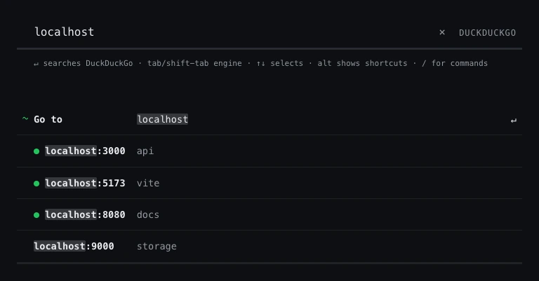

### Subreddit jump

A term written as `r/vuejs` or `/r/vuejs` leads the results as a jump to that subreddit instead of
a search. It costs nothing until a term is written that way, and it is a switch rather than a list.

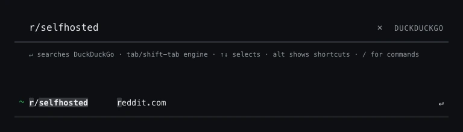

### Light and dark

Both palettes follow the OS by default and can be pinned per device in `#/settings`. The override
lives in the browser, so it is the one setting a lapsed session still changes.

It is applied before the app mounts, so a pinned theme never flashes the device's one first.

<table>
<tr>
<td>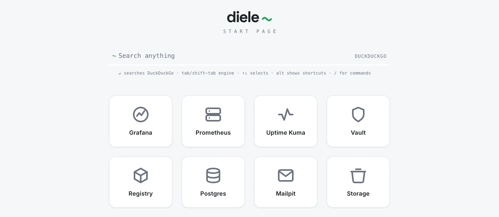</td>
<td>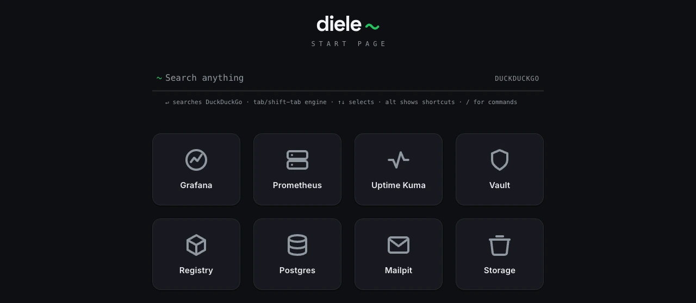</td>
</tr>
</table>

### The admin panel

`/admin` opens the panel, which is the same page in a different mode rather than a second app.
Cards, sites, engines, commands, ports, icons and connectors are all rows, all edited in place.

Each feature declares its own fields and the input each one needs, and the form is rendered from
that declaration - which is what lets a new connector be added without touching the web app at
all.

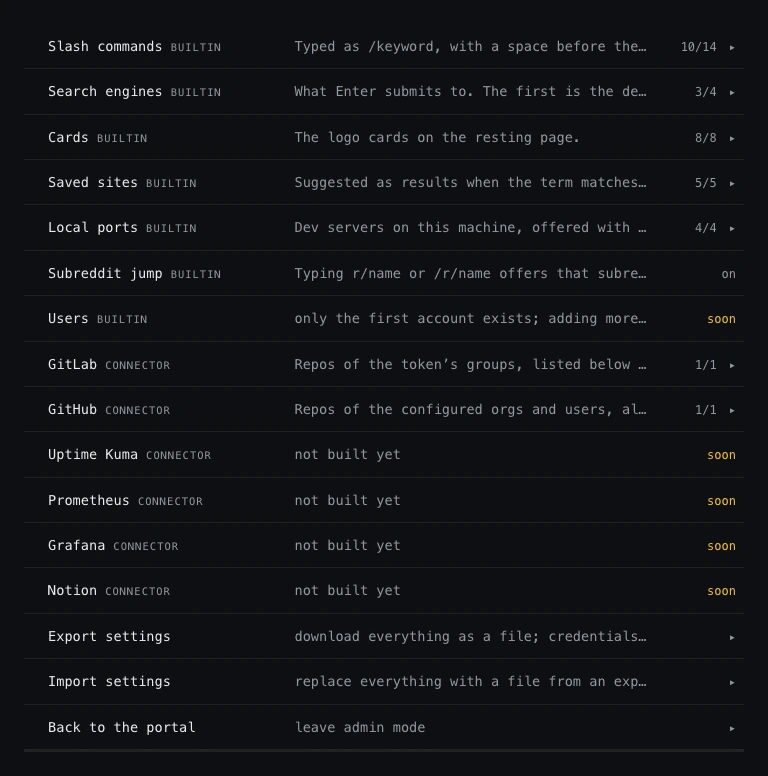

### Export and import

The whole configuration leaves as one versioned document and goes back into another instance the
same way: cards, sites, engines, commands, ports, icons and settings.

Connector credentials travel in that document still encrypted. An instance holding the same
`DIELE_SECRET_KEYS` restores a working connector; one holding a different key restores it switched
off, waiting for its token.

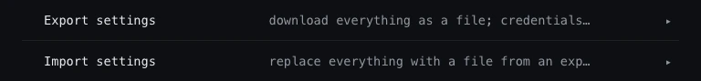

### Signing in

Three modes, all ending in the same opaque server-side session, so signing someone out actually
works.

| mode | is |
| --- | --- |
| `local` | accounts in diele's own database, argon2id passwords. The default, and it needs nothing configured |
| `oidc` | OpenID Connect with PKCE against any compliant issuer |
| `dev` | grants every login as a fixed identity while you work on the frontend, never for anything reachable by others |

A fresh instance in local mode opens on a **setup screen** rather than a login, because there is no
account yet. Creating the first one is gated by a token the server prints at startup.

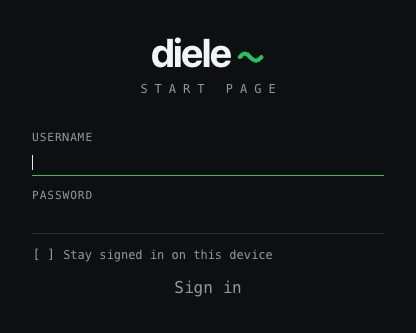

### Connectors

A connector is a feature whose rows come from somewhere else. Give one a token and some groups or
orgs, and your repos appear under the cards, each with its own quick jumps.

Entries are synced on a timer into diele's own store, so a restart never shows an empty list, and a
revoked token leaves the last good sync standing rather than wiping it. A connector is only saved
once its settings actually reach the source, so one cannot be stored in a state where every run is
going to fail.

Some connectors bring no rows at all and **decorate** the ones already there: Uptime Kuma and
Prometheus report [liveness](#liveness) rather than entries, so they are configured the same way
and show up in a different place.

Set `DIELE_SECRET_KEYS` before adding one: without a key there is nowhere safe to put a token, and
the panel says so instead of taking it.

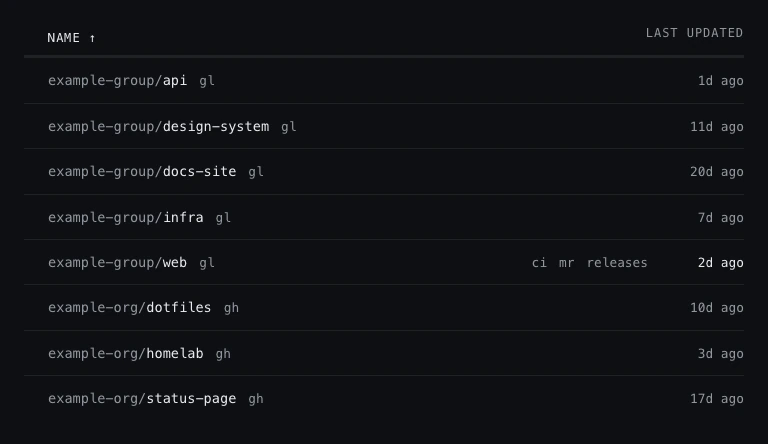

#### GitLab

| field | |
| --- | --- |
| **Instance** | origin only, `https://gitlab.com` or a self-hosted one |
| **Groups** | comma separated; empty means every group the token can see |
| **Access token** | stored encrypted, never returned |
| **Include subgroups** | on by default: repos of nested groups are listed alongside the group's own |

Create a **personal access token** under *Preferences → Access tokens* with the **`read_api`**
scope, on an account that can see the groups you name. Nothing is written, so no other scope
applies.

> GitLab caps token lifetime at one year. An expired token does not empty the list: the last good
> sync stands and the connector row reports the failure, which is where it becomes visible.

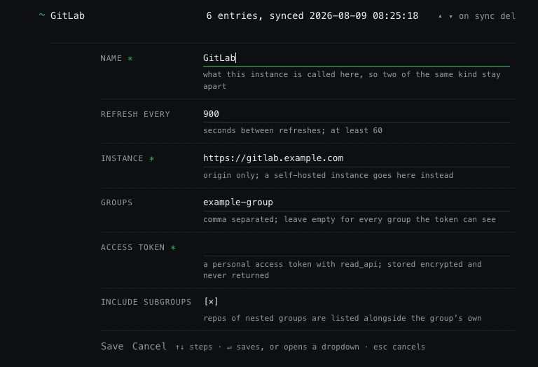

#### GitHub

| field | |
| --- | --- |
| **Instance** | origin only, `https://github.com` or a GitHub Enterprise one |
| **Orgs and users** | comma separated; empty means every repo the token can see |
| **Access token** | stored encrypted, never returned |

A **fine-grained personal access token** needs one permission and no more: *Repository permissions
→ **Metadata: Read-only***. Point its resource owner at the org or account whose repos you want,
grant it access to all repositories or pick them, and an org owner approves it if the org requires
approval.

A classic token works too and needs `repo` to see private repositories, or nothing at all for
public ones. It is the blunter instrument of the two: `repo` also carries write access, which diele
never uses.

diele only ever lists repositories. The pipeline, pull request and release jumps on each row are
plain links to GitHub, not API calls, which is why the permission set stays this small.

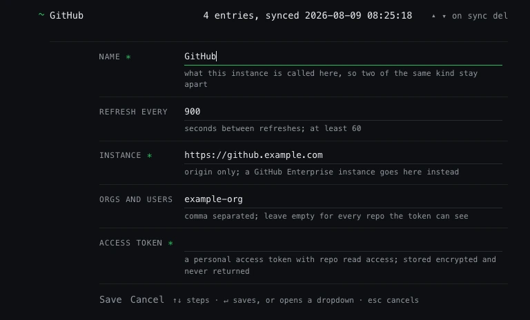

#### Uptime Kuma

| field | |
| --- | --- |
| **Instance** | origin only, where Uptime Kuma itself is served |
| **API key** | optional, only where the instance asks for one; stored encrypted, never returned |

Create one under *Settings → API Keys*. An instance running with authentication disabled serves
its metrics to anyone and needs no key here. It reads Kuma's Prometheus `/metrics` endpoint, which
carries **every** monitor whether or not a status page publishes it, so nothing has to be made
public to be used here.

Bind a card to it and leave **Monitor** blank to match by the card's own hostname, or name the
monitor when the two do not line up. `/metrics` reports the current state and no uptime
percentage, so the dot has a state and no figure beside it.

#### Prometheus

| field | |
| --- | --- |
| **Instance** | origin only; the query api is found under it |
| **Bearer token** | optional, only where the instance asks for one; stored encrypted |
| **Alertmanager** | optional; where [Alerts](#alerts) are read from when set. The token is reused, for the common case of both sitting behind one ingress |
| **Alerts from** | the least severe level that reaches the portal |
| **Hide Watchdog** | on by default; turn it off to keep the heartbeat alert on the page as proof the pipeline is up |

Each bound entry carries a **PromQL expression** of its own, run as an instant query: non-zero is
up, zero is down, and a result with no samples leaves the dot off rather than turning it red - a
query matching nothing is a mistake in the query, not an outage.

That means one request per bound entry on every refresh, so this is the connector to be sparing
with. An unauthenticated instance needs no `DIELE_SECRET_KEYS` at all, because there is no
credential to store.

The same instance also feeds [Alerts](#alerts), which costs one request whatever is bound and
needs nothing configured beyond the connector itself.

### Liveness

The dot on a card or a saved site. Every entry picks **one** source, from a dropdown in its own
editor that offers whatever is configured: the built-in HTTP probe, or any Uptime Kuma or
Prometheus connector you have added. The field below it changes with the choice, because a path,
a monitor name and a PromQL expression are not the same thing.

A source that **cannot be reached itself** turns the dots it answers for hollow with a red ring,
rather than red or missing. It knows nothing about the services it watches while it is down, so
calling them down would blame the wrong thing, and leaving the dot off is how a decorator stops
working without anyone noticing. Hovering says what failed. The HTTP probe never reports it:
reaching the service is the whole of what it measures, so unreachable there *is* down.

The **HTTP probe** needs nothing configured. It requests the entry's url and calls a `2xx` up.
Everything else is down, redirects included: a `302` to a login page is the most common way for a
service to look alive while answering nothing.

Its one field takes either a **path**, resolved under the entry's url, or a **whole url**, which
replaces it. The second is for a service this server reaches under a different address than the
one on the card - an in-cluster name, or a port the public url does not expose.

Probing happens on the server rather than in the browser, which is what makes the status code
readable at all - a cross-origin request from the page comes back opaque, with a `200`, a `500`
and a login redirect all indistinguishable. It also means one request per entry however many tabs
are open. Local ports are the deliberate exception and stay a browser probe, because the machine
holding the browser is the only one that can see them.

Saving a binding resolves it there and then, the way a connector's token is checked on save, so
the panel says whether it works while you are still looking at it - and unlike a connector it
cannot refuse the save, because a service being down is a fact about the service. The admin list
carries the same dot each entry shows on the portal, and `s` asks any bound row again.

Readings are held in memory and never written down. A quarter-hour-old repo list is worth keeping;
a quarter-hour-old *"up"* is not old, it is wrong. So a restart shows no dots until the first
refresh answers, an unreachable source drops its dots rather than reddening them, and the whole
feature has a switch of its own, inside **Cards** in the panel.

### Alerts

What a connected source reports as firing, on one line between the title and the search field. A
single alert is that line; several collapse into a count that opens onto the list. Worst first,
and longest-firing first within a severity, because a condition that has held for hours is the one
that is not fixing itself.

One request per configured source, whatever else is bound.

Which source that is depends on the **Alertmanager** field on the Prometheus connector:

| field | read from | |
| --- | --- | --- |
| blank | Prometheus `/api/v1/alerts` | the rules that instance evaluates, and only those. A silenced alert still shows, an HA pair reports twice, and an alert pushed straight into an Alertmanager never appears |
| set | Alertmanager `/api/v2/alerts` | active alerts only, so a **silence** takes the line down. Duplicates from an HA pair are merged, and alerts that came from anywhere else are included |

Set it. A silence is somebody saying they already know, and a portal that goes on reporting one
teaches everyone to read past the line, which is the whole of what the feature is worth. It is
optional only because a Prometheus without an Alertmanager in front of it is a real deployment.

How far down the list to read is the **Alerts from** setting on the connector:

| | |
| --- | --- |
| **Critical only** | for a portal that should stay blank unless something is genuinely on fire |
| **Warning and critical** | the default |
| **Info and up** | everything the source reports a severity for |

Worth knowing before picking the last one: on a stock kube-prometheus-stack, `info` is where
`CPUThrottlingHigh` and `NodeCPUHighUsage` live, and those are close to permanent residents on a
busy cluster. A line that is always lit is a line everyone learns to read past.

`Watchdog` is hidden by its own checkbox, on by default. It exists to prove the alerting path
works end to end, so on a healthy cluster it fires forever and is the one thing the portal would
permanently report. Turn the checkbox off and it stays on the page as a heartbeat: shown whatever
its label and wherever the floor sits, since the stock one carries `severity: none` and reading
that literally would mean the box never showed anything. It draws as the quietest thing on the
page, because a pipeline being alive is not an incident.

Only `pending` is never shown, at any setting: that is a rule whose condition has held for less
than its `for` clause, which is exactly the window its author asked not to be told about yet. An
alert labelled with a severity the portal has no word for is left off rather than guessed at.

**Silencing** is per line, and lives in diele rather than in the source. Hovering a line offers
it, and the arrows walk the lines from the search field for a keyboard. Who you are decides how
far it reaches: an admin takes the line off the portal for everyone, anyone else takes it off
their own. Either way it lasts only as long as the alert does - once the condition stops firing
the silence is forgotten, so the same alert next week is news again. Nothing about it reaches
Alertmanager, and it silences no notification.

The alert's own annotations are an **admin's**, the same as a reading's `detail`: they quote the
instance that fired and how it is addressed. Everyone signed in sees what is firing, how badly and
for how long, and the link through to where the source shows it in full.

Held in memory and never written down, like the readings: a restart reports nothing until the
first read answers, and an answer a few intervals old is dropped rather than shown. The whole
feature has a switch of its own in the panel, and with it off the portal asks its sources nothing.

### Planned

What is coming, in roughly the order it is meant to land.

| | |
| --- | --- |
| **Grafana** | dashboards, suggested as results when the term matches them |
| **Notion** | pages from a private workspace, suggested as you type |
| **Users and roles** | only the first account exists today; the `groups` claim is already carried onto the session, so the seam is there |
| **Sessions and devices** | every session an account has open, listed in the user settings and revocable one at a time |
| **Personal entries** | cards, saved sites, slash commands and search engines a user adds for themselves, on top of the ones an admin defines |
| **History** | opt in, and the urls you open are kept and offered in the search, listed in the user settings to drop, to clear, or to keep as a saved site |
| **Ranking that follows you** | what you open most keeps winning ties, on every browser you sign in from rather than only the one that opened it |
| **Inline answers** | `12*7`, `40f in c`, a hex or base conversion answered above the results instead of handed to an engine |
| **General component hardening and polish** | every view once more over: edge cases, empty and error states, focus order |

Under consideration: a resting page that paints the last known cards while the api answers, and
the extension beyond Chrome.

## Installation

### Docker

One container, one port, one volume. The api serves the built launcher itself, so both halves are
on one origin without a proxy in front to put them there.

```sh
docker volume create diele-data

docker run -d --name diele \
  -p 3000:3000 \
  -e PUBLIC_ORIGIN="http://localhost:3000" \
  -v diele-data:/data \
  --read-only --tmpfs /tmp \
  --cap-drop ALL \
  --security-opt no-new-privileges \
  --init \
  --restart unless-stopped \
  ghcr.io/bernhardkelm/diele:latest
```

Open it and the first page is the setup screen; the token that gates it is in `docker logs diele`.

**Required.** One value, and a wrong one paints the portal and then rejects every write - including
the form that claims the first account.

| variable | |
| --- | --- |
| `PUBLIC_ORIGIN` | the address people actually open, scheme and host; the OIDC redirect uri is derived from it |

**Optional.** Everything here has a working default. The image ships no `.env` at all, so each of
these is a real environment variable.

| variable | |
| --- | --- |
| `DIELE_SECRET_KEYS` | `id:base64` pairs sealing connector credentials, first one active. Set it before adding a connector: `echo "k1:$(openssl rand -base64 32)"` |
| `AUTH_MODE` | `local` (default), `oidc` or `dev` |
| `OIDC_ISSUER`, `OIDC_CLIENT_ID`, `OIDC_CLIENT_SECRET` | required when `AUTH_MODE=oidc`; see [the api README](api/README.md#setting-up-an-oidc-provider) |
| `TRUST_PROXY` | off by default; set to the number of proxies in front (`1` behind nginx) so `req.ip` is the caller and not a header |
| `BRAND_TITLE`, `BRAND_SUBTITLE` | the wordmark and the line under it |
| `BRAND_ACCENT_LIGHT`, `BRAND_ACCENT_DARK` | the accent, one six-digit hex per theme; the favicons, the iOS home-screen icon and the web manifest are drawn from it at boot |
| `LOCAL_SETUP_TOKEN` | gates creating the first account; generated and printed when unset |
| `SESSION_MAX_AGE_MS`, `SESSION_REMEMBER_MAX_AGE_MS` | idle windows, not lifetimes; they roll forward on use |
| `DIELE_SEED_STOCK_CONFIG` | `false` creates the database without the stock engines, commands and ports |

Losing `DIELE_SECRET_KEYS` means re-entering every credential by hand, so back it up somewhere
other than the database. The [full variable list](api/README.md#configuration), including the ones
that only matter outside a container, is in the api README.

The process runs as uid 1000 against a read-only root filesystem with no capabilities, so `/data`
is the only path it can write. A named volume takes its ownership from the image and needs nothing
further; a bind mount is a directory the host already owns, so it has to be handed over:

```sh
mkdir -p /srv/diele && sudo chown 1000:1000 /srv/diele    # then -v /srv/diele:/data
```

`/status` answers without a session and names the running build, which is what the image's own
`HEALTHCHECK` reads.

A fresh database holds what **every** portal holds anyway and nothing more: four search engines,
ten slash commands and three local ports, most of them switched off and waiting in the admin view.
Nothing that guesses at your infrastructure, because an instance showing cards nobody added would
be doing exactly that. `DIELE_SEED_STOCK_CONFIG=false` gives you the bare database instead.

For something to look at, open `#/admin` → *Import* and pick
[`api/example-seed.json`](api/example-seed.json), which adds example cards and saved sites. Note
that an import **replaces** the whole configuration rather than adding to it, so it is a first-run
move, not a way to top up a portal you have already set up.

### Making it your new tab page

Chrome has no setting for this - overriding the new tab page takes an extension, so there is one in
[`extension/`](extension/README.md). Load it unpacked from `chrome://extensions`, open a new tab,
and enter the address of your instance. It asks for the `storage` permission and nothing else: no
host access, no build step, no third party.

Its toolbar button holds the list, so a private portal and a work one can both live there and new
tabs follow whichever is marked - switched in a click, with nothing to retype.

Edge, Brave, Vivaldi and Opera load the same folder the same way. Safari needs no extension: it
opens new tabs with the home page, so setting that is enough. Firefox has no such setting and
would need the extension, which has not been tried there.

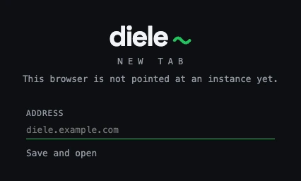

### Backing up

A database in WAL mode is three files, so copying `diele.db` out from under a running portal gives
you one that is missing whatever the write-ahead log still holds. It can copy itself instead:

```sh
docker exec diele node -e \
  "require('better-sqlite3')(process.env.DB_PATH).exec(\"VACUUM INTO '/data/backup.db'\")"
docker cp diele:/data/backup.db "./diele-$(date +%F).db"
```

`VACUUM INTO` takes a read transaction, so it is safe while the portal is serving, and it refuses
to overwrite a file that is already there.

### Which tag

`latest` follows the newest release and `0.4` the newest patch of that minor, while `0.4.0` never
moves. Prereleases are published under their full version and move neither of the first two.

diele is 0.x: a minor may change behaviour, and migrations are forward-only and immutable, so a
database a newer image has already migrated is not one an older image can open. Pin a version you
have run, back up before moving to another, and treat going back as a restore rather than a
rollback.

### From source

Needs Node 24.7 or newer. Nothing else - the database is a file.

```sh
git clone https://github.com/bernhardkelm/diele.git
cd diele
npm install
npm run dev
```

No configuration step: the defaults are committed, so that starts the API on `:3000` and the web
app on `:5173` and creates the SQLite database on first boot. Open **http://localhost:5173**.

To serve it the way the image does, as one origin with no dev server:

```sh
npm ci
npm run build
npm start
```

## Documentation

```
diele/
├── web/        the launcher - Vue 3, Vite                        → web/README.md
├── api/        sign-in, storage, connectors - Express 5, SQLite  → api/README.md
├── common/     the wire types both sides share
├── extension/  Chrome new tab override, no build step            → extension/README.md
└── data/       the SQLite database, created on first boot, gitignored
```

- [**web/README.md**](web/README.md) - the search ring, the settings and admin views, how connector
  entries reach the page, and how to develop against the app alone.
- [**api/README.md**](api/README.md) - auth and sessions, the full configuration reference, the
  database, every endpoint, and what a connector module has to implement.
- [**extension/README.md**](extension/README.md) - loading the new tab override, keeping several
  instances and switching between them, and what counts as an address.
- [**CONTRIBUTING.md**](CONTRIBUTING.md) - what diele is and is not, where code goes, and the
  conventions worth writing down.
- [**SECURITY.md**](SECURITY.md) - what diele is exposed to, and how to report a vulnerability.

## License

Copyright (C) 2026 Bernhard Kelm

diele is free software under the **GNU Affero General Public License, version 3 or later**. You
may use, study, change and redistribute it. See [LICENSE](LICENSE) for the full text.

The Affero part matters here, because diele is something people host: section 13 says that if you
run a **modified** version and let others use it over a network, you have to offer those users
the source of your modified version. Running it unmodified, for yourself or your team, asks
nothing of you.
